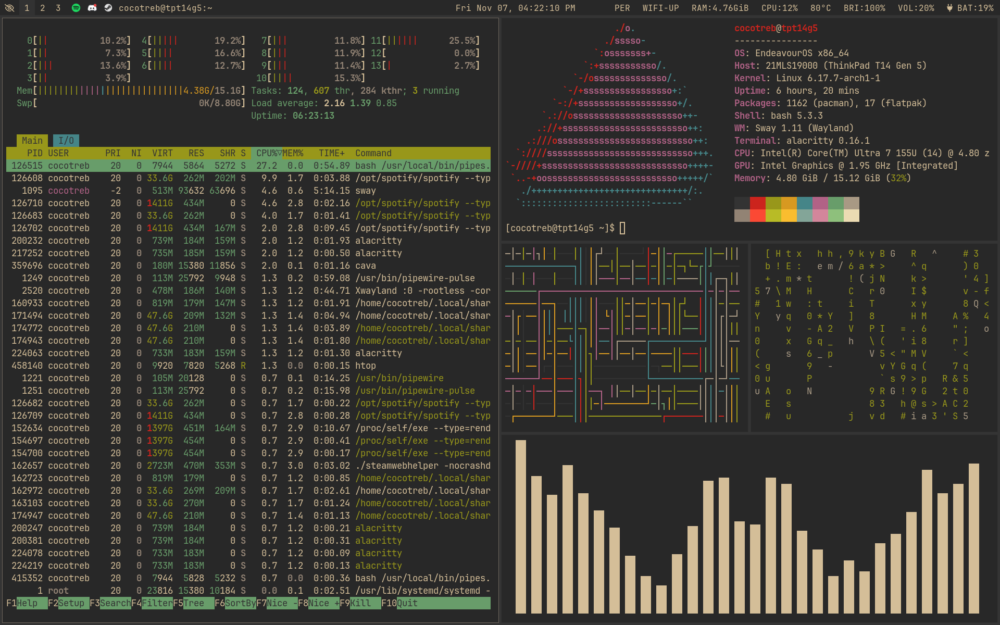

# Personal Dotfiles

These are the dotfiles for my daily driver! I use EndeavourOS alongside SwayWM, but these should work on any distro. Feel free to use these for inspiration or as a template for your own dotfiles.

Keep in mind that these dotfiles aren't drag-and-drop ready and that this repo is mainly for personal use. There are a couple of absolute paths that require you to manually tweak them (the background in the Sway config comes to mind).

## Dependencies:
- sway
- fuzzel
- alacritty
- waybar
- Phinger Cursors
- neovim
- wlogout
- swaylock
- swaync
- Thunar
### Optional Dependencies:
- btop
- htop
- cava
- Discord and Vencord

## Instructions for installation
1. Copy the contents of the `config` folder to `.config`. Do the same in `themes` and `icons` and their respective folders.
2. The chrome folder is for Firefox custom CSS, and is based on [SimpleFox](https://github.com/migueravila/simplefox). Detailed instructions for installation can be found in their repo.
3. Tweak the filepaths in the config files.
4. Presto! You are ready to go.

## Gallery

<<<<<<< Updated upstream
<<<<<<< Updated upstream

=======

>>>>>>> Stashed changes
=======

>>>>>>> Stashed changes

### TODO:
- Install and implement ewww
